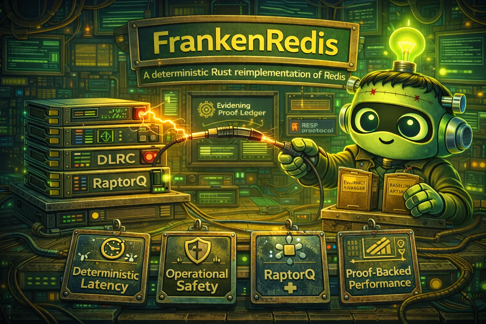

# FrankenRedis

<div align="center">
  
</div>

FrankenRedis is a clean-room Rust reimplementation targeting grand-scope excellence: semantic fidelity, mathematical rigor, operational safety, and profile-proven performance.

Absolute project goal: full drop-in replacement parity with legacy Redis behavior for the complete intended Redis surface, not a permanently reduced feature subset.

## What Makes This Project Special

Deterministic Latency Replication Core (DLRC): strict command semantics with tail-aware scheduling and recoverable persistence pipelines.

This is treated as a core identity constraint, not a best-effort nice-to-have.

## Methodological DNA

This project uses four pervasive disciplines:

1. alien-artifact-coding for decision theory, confidence calibration, and explainability.
2. extreme-software-optimization for profile-first, proof-backed performance work.
3. RaptorQ-everywhere for self-healing durability of long-lived artifacts and state.
4. frankenlibc/frankenfs compatibility-security thinking: strict vs hardened mode separation, fail-closed compatibility gates, and explicit drift ledgers.

## Current State

- project charter and porting docs established
- legacy oracle cloned at `/data/projects/frankenredis/legacy_redis_code/redis`
- first executable vertical slice landed:
  - RESP parser/encoder
  - broad command surface across strings, hashes, lists, sets, sorted sets, streams, geo, pub/sub, and server control paths
  - in-memory store + TTL semantics
  - replication sync baseline: `PSYNC`/`SYNC` negotiation, full-resync snapshot apply, partial backlog replay, replica reconnect flow, and live replication offset reporting
  - strict/hardened compatibility gate + evidence ledger scaffold
  - fixture-driven conformance harness (`core_*` families + phase2c packet suites)
- baseline and proof artifacts added:
  - `baselines/round1_conformance_baseline.json`
  - `baselines/round1_conformance_strace.txt`
  - `baselines/round2_protocol_negative_baseline.json`
  - `baselines/round2_protocol_negative_strace.txt`
  - `golden_checksums.txt`

## Full Drop-In Parity Contract

- 100% feature/functionality overlap with legacy Redis target surface is mandatory.
- Any staged rollout is sequencing only, never a permanent exclusion.
- Every deferred surface must be represented as an explicit blocking backlog item with closure criteria.
- Strict mode must preserve Redis-observable replies, side effects, and ordering across the full parity program.

## Architecture Direction

RESP parser -> command router -> data engine -> persistence -> replication

## Concrete Execution Path (Current Code)

1. RESP parsing/encoding lives in `crates/fr-protocol/src/lib.rs` via `parse_frame` and `RespFrame::to_bytes`.
2. Runtime ingress starts at `Runtime::execute_bytes` (`crates/fr-runtime/src/lib.rs`), which parses wire bytes and emits fail-closed evidence on protocol errors.
3. `Runtime::execute_frame` performs preflight policy checks, handles special runtime commands (auth, acl, config, cluster, transaction, persistence controls), enforces auth/maxmemory gates, and runs active-expire before general dispatch.
4. General command dispatch flows through `fr_command::dispatch_argv` (`crates/fr-command/src/lib.rs`) into command handlers that mutate/read `Store` with deterministic `now_ms` semantics.
5. Expiration semantics are centralized in store + `fr-expire` (`evaluate_expiry`), preserving Redis-visible `TTL/PTTL` return contracts (`-2`, `-1`, positive remaining lifetime).
6. Successful write dispatch captures persistence/replication signals in runtime (`capture_aof_record`), appending `fr-persist::AofRecord` entries and advancing replication offsets.
7. Conformance execution is driven by `fr-conformance::run_fixture`, which instantiates strict or hardened runtime modes and validates both reply parity and threat/evidence expectations.

## Compatibility and Security Stance

Preserve Redis-observable replies, side effects, and ordering guarantees for full parity scope.

Defend against malformed protocol frames, replay/order attacks, and persistence tampering.

## Performance and Correctness Bar

Track throughput and p95/p99 latency under mixed workloads; gate persistence overhead and replication-lag regressions.

Maintain deterministic command semantics, expiration behavior, and AOF/RDB recovery ordering invariants.

## Key Documents

- AGENTS.md
- COMPREHENSIVE_SPEC_FOR_FRANKENREDIS_V1.md
- COMPREHENSIVE_SPEC_FOR_FRANKENSQLITE_V1_REFERENCE.md (copied exemplar from `frankensqlite`)
- TEST_LOG_SCHEMA_V1.md

## Next Steps

1. Expand conformance fixtures until all command families and compatibility-critical behaviors are covered.
2. Expand persistence and replication invariants from the implemented sync baseline to broader legacy-oracle parity coverage.
3. Add Asupersync-backed runtime adapter and FrankenTUI operator dashboard adapter.
4. Implement RaptorQ sidecar pipeline for all durability-critical artifacts.
5. Run optimization loop with one lever per commit and isomorphism proofs while preserving strict parity.

## Porting Artifact Set

- PLAN_TO_PORT_REDIS_TO_RUST.md
- EXISTING_REDIS_STRUCTURE.md
- PROPOSED_ARCHITECTURE.md
- FEATURE_PARITY.md

These four docs are now the canonical porting-to-rust workflow for this repo.

## Validation Commands

```bash
# Offloaded (recommended in multi-agent sessions)
rch exec -- cargo fmt --check
rch exec -- cargo check --workspace --all-targets
rch exec -- cargo clippy --workspace --all-targets -- -D warnings
rch exec -- cargo test --workspace
rch exec -- cargo test -p fr-conformance -- --nocapture
rch exec -- cargo run -p fr-conformance --bin phase2c_schema_gate -- --optimization-gate
rch exec -- cargo bench

# If rch is unavailable, run the same commands with plain cargo.
```

## License

MIT License (with OpenAI/Anthropic Rider). See `LICENSE`.

## Round 1 Benchmark Script

```bash
./scripts/benchmark_round1.sh
```

## Round 2 Benchmark Script

```bash
./scripts/benchmark_round2.sh
```
